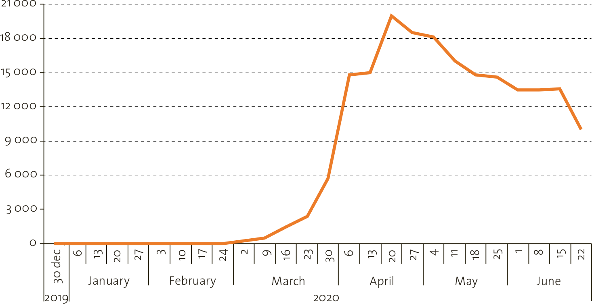

[Home](../../index.md) / [Research](../index.md) /
# Proposal
This project takes a pre-existing cyber-enabled domain, be it a personal home, 
factory, office space etc. and configures all the devices within the immediate 
area to the highest standards of defence in respect to cybersecurity. This 
takes a lot of the leg-work out of cybersecurity implementations and research 
for particular organisations and individuals. It does this through the use of 
Distributed Ledger Technologies (DLTs) for storing relevant cyber information 
which is then used to inform machine learning processes that seek relevant 
governance, risk management and compliance frameworks, guides and laws for that 
particular business and then goes about configuring the devices to the 
standards set out by these frameworks, guides and laws. To do this, it supports
a multitude of custom scripts and pre-existing tools to cover as many use-cases
as possible.

Cybersecurity governance is needed now more than ever, especially in a post 
COVID-19 world. As more and more people have begun to work from home on remote 
IT infrastructure, many vulnerabilities and weaknesses within the realm of 
cybersecurity have arisen or greatly expanded in direct correlation to this 
opening up of our digital freedoms. As Rodrigo Mariano Díaz (consultant for the
UN ECLAC) puts it, COVID-19 is; "becoming a catalyst of digital transformation,
as well as accelerating human beings’ adaptability to new forms of work. With 
its arrival, as well as the urgency of information and news distribution, 
COVID-19-related phishing and ransomware attacks increased exponentially, 
becoming a catalyst of digital transformation, as well as accelerating human 
beings’ adaptability to new forms of work. With its arrival, as well as the 
urgency of information and news distribution, COVID-19-related phishing and 
ransomware attacks increased 
exponentially[1](bibliography/index.md)". See the Fig. 1 below  to 
gain insight on what this growth looks like.

FIGURE 1: World Cyberattacks since the Appearance of COVID-19 (In Number of 
Weekly Attacks)[1](bibliography/index.md)

With  the  rise  in  a  need  for  cybersecurity  comes  the  need for 
cybersecurity governance, but many industries and nations may find themselves 
struggling to comply with current governance  standards.  Enter  cybersecurity  
governance  frameworks which are  effective  outlines  of  how  to  achieve  
cybersecurity governance  targets.  One of the objectives for  this  project  
is to seek any relevant cybersecurity governance frameworks for a given 
organisation and automate the application of these frameworks to the 
organisation's domain.

This rise in need for cybersecurity governance goes hand in hand with risk 
management, as sacrifices in cybersecurity implementations inherently come with 
elements of risk. Sometimes, within an organisation, sacrifices like this must 
be made. Inversely, a minor cybersecurity implementation may lead to a major 
deferral in risk. It's important to gauge and optimise your cybersecurity 
decision-making around this relationship and for this, risk management 
frameworks are more than useful. This project looks to automate the 
decision-making process and establishment of an organisation's relevant risk 
management frameworks.

All of this is to be explored with a select few dummy organisations with the 
goal of creating a more general purpose implementation. As with any kind of 
industry, there are coinciding industry regulations at play. Adherence to these 
regulations will be done using any relevant compliance frameworks for the 
given organisation's industry sector.

This project seeks to automatically examine any relevant cybersecurity 
governance frameworks, risk management frameworks and industry regulations and 
will form a layout of the organisation's cybersecurity GRC Requirements as well 
as an automated implementation approach henceforth known as the tool 
"AutoCompliance".

## Research Area
Zero trust security for endpoints and clients alongside security automation are 
the core research areas of the project. Machine learning is to be used for the 
formation of organisation profiles. This project takes a look at how to 
automate the implementation of a programme of cybersecurity governance, 
risk management and compliance in any given organisation through the use of 
Distributed Ledger Technologies. Governance, Compliance and regulatory 
frameworks as well as numerous laws will be researched. These include but are 
not limited to; NIST, OSSTMM, PMMM, PMBoK, COBIT, ISO/IEC 27014:2020, National 
Cyber Security Strategy - Government of Ireland, NIST RMF, ISO/IEC 27005:2018, 
CMMC,GDPR, PCI DSS, ENISA Strategy, AT-101 (SOC2), ISO 9001:2015 and ISO/IEC 
27001:-2013.

### Project Goals
- Investigate how far one can minimise human involvement in the cybersecurity 
governance, risk management and compliance space. The process is often 
laborious and resource intensive for an organisation.
- Work towards reducing liability or human error for any given organisation in 
regard to implementing a GRC programme. Peace of mind as it were.
- Experiment with the utilisation of distributed ledger technologies in an 
ecologically friendly, efficient and reasonable manner to inform the machine 
learning processes mentioned below. DLTs and their effect on the environment is 
a heavily discussed topic at the moment and advancements made here could lead 
to further environmentally friendly practices in the space.
- See if implementing machine learning to help process specific organisation 
GRC requirements automatically and dynamically. No two organisations are the 
same when it comes to GRC requirements and this must be accounted for.
- Try to find the necessary tools and technologies that meet these 
aforementioned GRC requirements. Malware scanning, firewall rules, port 
management to name a few could all be manipulated to suit particular GRC 
requirements.
- Attempt to ease the process of internal and external auditing in regard to 
GRC for any given organisation through automated report and design documenting 
as a result of a successful/unsuccessful GRC implementation. Leave a paper 
trail at every step of the implementation of a GRC programme. 

### Research Question & Deliverables
- Can DLTs help implement a GRC programme better than other means?
  - A comparison report of DLT performance compared to the conventional means 
  for implementing a GRC programme.
  - DLT solution(s) that assist with the implementation of a GRC programme in 
  any given organisation. 
- Is there anything that can't or should not be automated in the 
implementation? Why? 
  - A breakdown on all items that can not be automated with in depth technical 
  analysis as to why that is the case.
- Are existing implementation solutions suitable or is there more work to be 
done?
  - A definition on what is to be classified as "suitable".
  - An outline of all that needs to be done to reach a suitable state.
- What possible future technical developments need to be accounted for in the 
GRC space?
  - A list of future technical areas and a description on how they should be 
  accounted for in the future.
- Is machine learning the best way towards total zero trust security solutions?
  - A comparison report of ML performance compared to the conventional means \
  for implementing zero trust security in an organisation's network.
  - ML solution(s) that assist with the implementation of a zero trust security 
  network in any given organisation.

## Project Resources
- [Mega Cloud Files](https://mega.nz/folder/GgpV3QJT#12NyyoDLzVzn425jrK8EOQ) 
- [GitHub](https://github.com/andrewk10/AutoCompliance)
- [Meeting Notes and Outstanding Items](https://docs.google.com/document/d/1gxrai-zpmATkwgbDc8EFp_WIKIwZ2ojA_dCE4tvENAk/edit?usp=sharing)